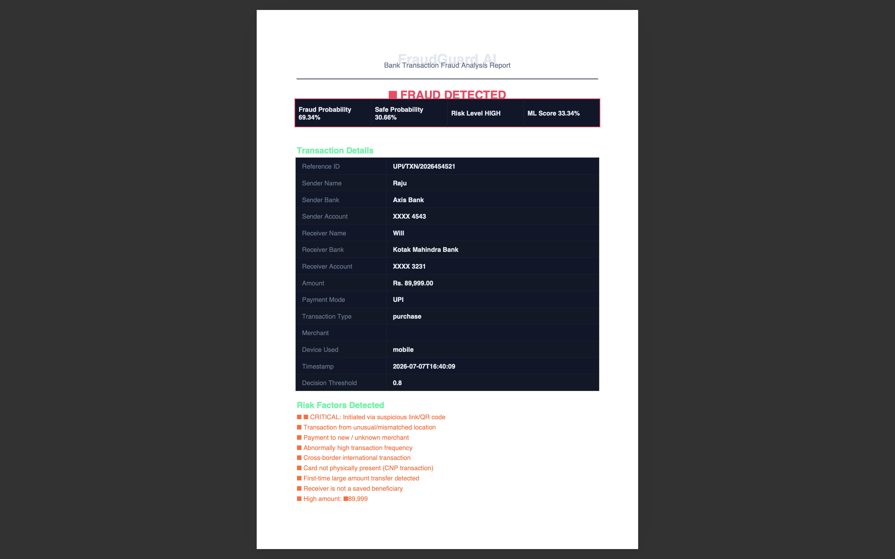
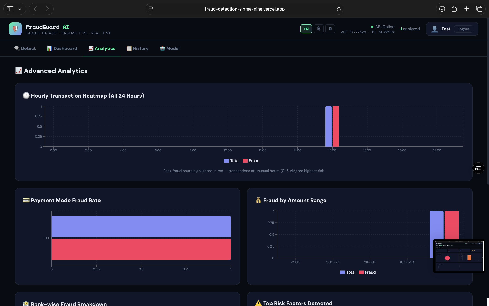
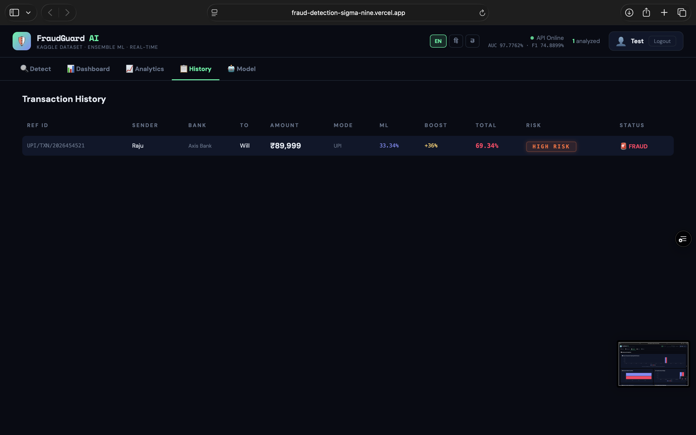
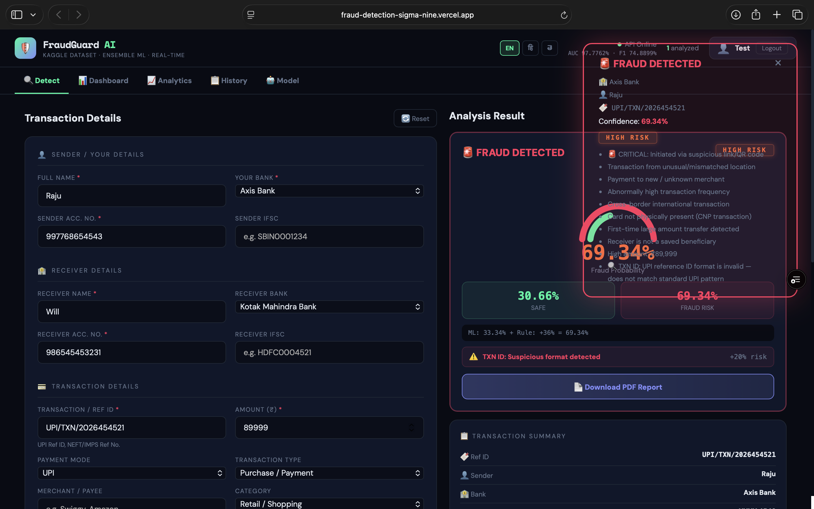
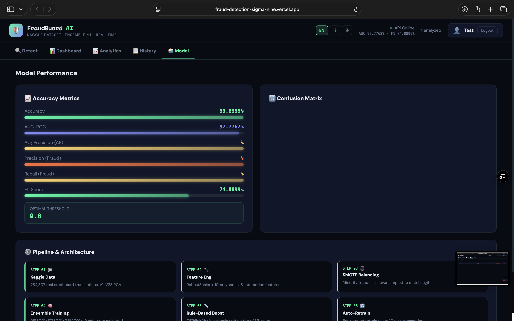
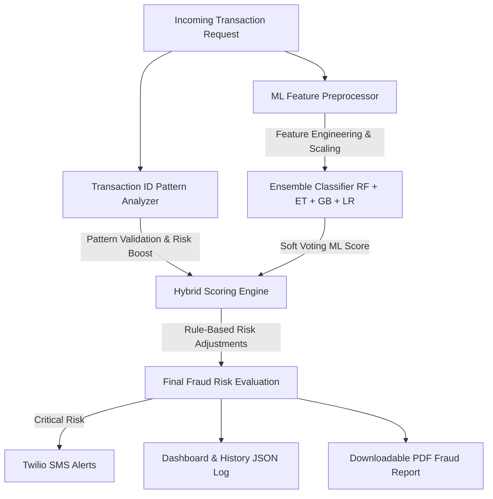

# FraudGuard AI 🛡️
### Real-time ML-Powered Bank Transaction Fraud Detection System

FraudGuard AI is a hybrid fraud-detection platform that combines **Machine Learning (Ensemble Soft Voting)** with **Rule-Based Risk Boosting** to evaluate bank transactions (UPI, NEFT, IMPS, Card) in real-time. It features interactive analytics dashboards, historical log analysis, automated Twilio SMS alert notifications, and downloadable PDF reports.

---

## 🚀 Live Demos
- **Frontend Dashboard (Vercel)**: [https://fraud-detection-sigma-nine.vercel.app](https://fraud-detection-sigma-nine.vercel.app)
- **Backend API (Render)**: [https://fraud-detection-9d6d.onrender.com](https://fraud-detection-9d6d.onrender.com)

---

## 📸 System Screenshots

### 1. Real-time Transaction Analysis
Evaluate incoming transaction parameters, view explanation logs of safety indicators, and trigger alert generations.


### 2. Analytics Dashboard
Keep track of key performance indicators, fraud rate trends, and risk distributions.


### 3. Advanced Insights & Heatmaps
Visualize peak fraud times, category-wise breakdowns, and payment method vulnerabilities.


### 4. Historical Logs
Explore the database of past analyzed transactions with full breakdown of ML vs. Rule-based scores.


### 5. Model Performance Metrics
Check the health status and validation metrics of the live ensemble model.


---

## ⚙️ How It Works (System Architecture)



### 1. Feature Engineering & Preprocessing
To match the PCA-transformed Kaggle dataset, the system generates matching synthetic inputs and constructs engineered features:
- **Scalers**: Robust scaling is applied to `Amount` and `Time` features.
- **Interactions**: Multiplicative relations (e.g. `V1_V2`, `V3_V4`, `V5_V6`) are generated to capture complex boundary relationships.
- **Polynomial Features**: Critical PCA component values are squared (e.g. `V14_sq`, `V17_sq`, `V11_sq`).
- **Key Risk Metric**: Calculates average magnitude of components historically tied to card-present/online fraud vectors.

### 2. NumPy-Based SMOTE Oversampling
To tackle extreme class imbalance (only 0.17% fraud rate), a custom SMOTE (Synthetic Minority Over-sampling Technique) balances the training split by synthesizing new minority samples near existing K-nearest neighbors, creating a balanced 50/50 dataset for model training.

### 3. Soft-Voting ML Ensemble
Combines four classifiers to achieve a robust decision boundary:
1. **Random Forest (RF)**: Captures non-linearities and reduces variance.
2. **Extra Trees (ET)**: Extremely randomized trees to combat overfitting.
3. **Gradient Boosting (GBM)**: Focuses sequentially on hard-to-classify samples.
4. **Logistic Regression (LR)**: Linear baseline for stable probability calibration.

### 4. Hybrid Scoring & Rule Boost
The final fraud risk is a blend of:
- **ML Probability Score** (e.g., `33.34%`)
- **Rule-based Additive Adjustments** (e.g., OTP sharing, international card-not-present transfers, location mismatches, or suspicious links add another `+36%` to the score)
- **Transaction ID Pattern Score**: Analyzes UPI/Ref IDs for validity, adding up to `+20%` risk.

---

## 🛠️ Installation & Local Running

### Prerequisites
- Python 3.10
- Node.js & npm

### Backend Setup
1. Clone the repository and navigate to the backend folder:
   ```bash
   cd backend
   ```
2. Initialize the virtual environment and install dependencies:
   ```bash
   python3 -m venv venv
   source venv/bin/activate
   pip install -r requirements.txt
   ```
3. Download the Kaggle Credit Card Fraud dataset:
   - Download `creditcard.csv` from [Kaggle](https://www.kaggle.com/datasets/mlg-ulb/creditcardfraud).
   - Place `creditcard.csv` in the `backend/` folder.
4. Run the backend Flask server:
   ```bash
   python app.py
   ```

### Frontend Setup
1. Navigate to the frontend folder:
   ```bash
   cd ../frontend
   ```
2. Install Node packages:
   ```bash
   npm install
   ```
3. Create a `.env` file in the `frontend/` folder:
   ```env
   REACT_APP_API_URL=http://localhost:5000
   ```
4. Start the React development server:
   ```bash
   npm start
   ```
